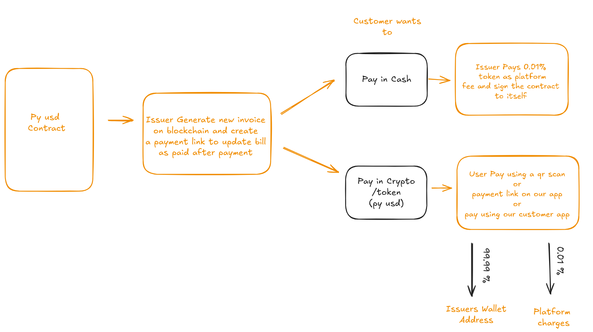
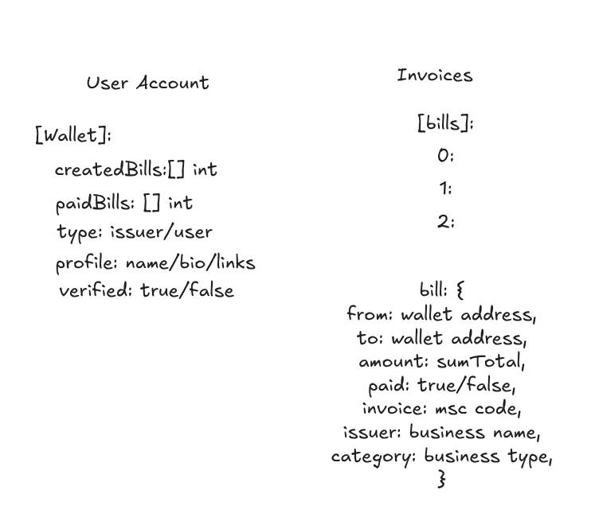

# 🧾 PYUSD Invoice Management System

> A blockchain-powered invoice management platform with spreadsheet functionality, PYUSD payments, and decentralized storage.

[](https://sepolia.etherscan.io/address/0xE1D6BFe21AD6e58Bd9aeFd5C4D23600F794F450C)
[](https://paxos.com/pyusd/)
[](https://firebase.google.com/)
[](https://ipfs.io/)

**Deployed Smart Contract:** [`0xE1D6BFe21AD6e58Bd9aeFd5C4D23600F794F450C`](https://sepolia.etherscan.io/address/0xE1D6BFe21AD6e58Bd9aeFd5C4D23600F794F450C)

---

## 📖 Overview

The PYUSD Invoice Management System is a full-stack decentralized application that combines traditional spreadsheet functionality with blockchain technology. It enables businesses to create, manage, and receive payments for invoices using PYUSD (PayPal USD) stablecoin on Ethereum.

### ✨ Key Features

- 📊 **Spreadsheet-Based Invoices** - Built-in spreadsheet engine (SocialCalc) for flexible invoice creation
- ⛓️ **Blockchain Integration** - Invoices stored on Ethereum Sepolia testnet with smart contract verification
- 💰 **PYUSD Payments** - Accept payments in PayPal USD stablecoin with automatic settlement
- 🔥 **Firebase Storage** - Transaction history and payment records stored in Firebase Firestore
- 📦 **IPFS Storage** - Decentralized invoice document storage via Pinata
- 📱 **QR Code Payments** - Generate QR codes for easy mobile payments and invoice sharing
- 🔐 **Wallet Integration** - Seamless MetaMask connection with Wagmi and RainbowKit
- 💼 **Platform Fees** - Automatic 0.01% platform fee distribution
- 📲 **PWA Support** - Install as a Progressive Web App on any device

---

## 🎯 User Flow



### Payment Process

1. **Invoice Creation**: Issuer creates invoice on blockchain with IPFS hash
2. **Payment Options**:
   - **Cash Payment**: Issuer pays 0.01% platform fee and signs contract
   - **Crypto Payment**: Customer pays via QR scan or payment link
3. **Fee Distribution**:
   - 99.99% → Issuer's wallet
   - 0.01% → Platform charges

---

## 🏗️ Architecture



### Smart Contract Structure

**User Account:**
- `[wallet]`: Address
- `createdBills[]`: Array of invoice IDs
- `paidBills`: Array of paid invoice IDs
- `type`: issuer/user
- `profile`: name/bio/links
- `verified`: true/false

**Invoices:**
- `[bills]`: 0, 1, 2...
- `bill`: 
  - `from`: wallet address
  - `to`: wallet address
  - `amount`: sumTotal
  - `paid`: true/false
  - `invoice`: msc code
  - `issuer`: business name
  - `category`: business type

## 🗂️ Project Structure

```
src/
├── abi/                  # Smart contract ABIs
│   ├── contracts.ts     # Contract addresses and constants
│   └── invoiceManage.ts # Invoice Manager ABI
├── components/           # Reusable UI components
│   ├── Files/           # File management components
│   ├── FileMenu/        # File operations menu
│   ├── Menu/            # Application menu
│   ├── socialcalc/      # Spreadsheet engine
│   ├── Storage/         # Local storage management
│   ├── WalletConnect.tsx # Wallet connection component
│   ├── CreateInvoiceModal.tsx # Invoice creation modal
│   └── DynamicInvoiceForm.tsx # Dynamic form builder
├── config/              # Configuration files
│   ├── firebase.ts      # Firebase initialization
│   └── wagmi.ts         # Web3 wallet configuration
├── contexts/            # React contexts for state management
│   ├── InvoiceContext.tsx # Invoice state management
│   └── ThemeContext.tsx  # Theme management
├── hooks/               # Custom React hooks
│   └── usePWA.ts        # PWA installation hook
├── pages/              # Main application pages
│   ├── FilesPage.tsx   # File explorer
│   ├── Home.tsx        # Main spreadsheet editor
│   ├── Invoice.tsx     # Invoice viewing/payment page
│   ├── LandingPage.tsx # Landing page
│   └── SettingsPage.tsx # Settings page
├── services/           # Application services
│   ├── invoicePaymentService.ts # Firebase payment service
│   ├── ipfsUpload.ts   # IPFS upload via Pinata
│   └── exportAsPdf.ts  # PDF export functionality
├── theme/              # CSS themes and variables
└── utils/              # Utility functions
    ├── helper.ts       # Helper functions
    └── offlineStorage.ts # Offline data management

blockchain/
├── contracts/          # Solidity smart contracts
│   ├── InvoiceManager.sol # Main invoice contract
│   └── MockPYUSD.sol   # Mock PYUSD for testing
├── scripts/            # Deployment scripts
│   ├── deploy.js       # Contract deployment
│   └── test-invoice.js # Invoice testing script
├── test/               # Contract tests
│   └── InvoiceManager.test.js
└── utils/              # Blockchain utilities
    ├── networks.js     # Network configurations
    └── ipfs.js         # IPFS integration
```
---

## 🚀 Getting Started

### Prerequisites

- Node.js v16 or higher
- npm or yarn
- MetaMask wallet
- Firebase account
- Pinata account (for IPFS)

### Installation

1. **Clone the repository:**
   ```bash
   git clone https://github.com/anisharma07/pyusd-invoice-mvp.git
   cd pyusd-invoice-mvp
   ```

2. **Install dependencies:**
   ```bash
   npm install
   ```

3. **Configure environment variables:**
   
   Create a `.env` file in the root directory:
   ```env
   # Pinata IPFS Configuration
   VITE_PINATA_API_KEY=your_pinata_api_key
   VITE_PINATA_SECRET_KEY=your_pinata_secret_key
   
   # Firebase Configuration
   VITE_FIREBASE_API_KEY=your_firebase_api_key
   VITE_FIREBASE_AUTH_DOMAIN=your-project-id.firebaseapp.com
   VITE_FIREBASE_PROJECT_ID=your-project-id
   VITE_FIREBASE_STORAGE_BUCKET=your-project-id.appspot.com
   VITE_FIREBASE_MESSAGING_SENDER_ID=your_sender_id
   VITE_FIREBASE_APP_ID=your_app_id
   ```

4. **Start the development server:**
   ```bash
   npm run dev
   ```

5. **Build for production:**
   ```bash
   npm run build
   ```

---

## 💼 Smart Contract Details

### Contract Address
- **Network**: Ethereum Sepolia Testnet
- **Address**: [`0xE1D6BFe21AD6e58Bd9aeFd5C4D23600F794F450C`](https://sepolia.etherscan.io/address/0xE1D6BFe21AD6e58Bd9aeFd5C4D23600F794F450C)
- **PYUSD Token**: `0xCaC524BcA292aaade2DF8A05cC58F0a65B1B3bB9` (Sepolia)

### Contract Features

#### 1. User Account System
- **User Types**: USER (payer) and ISSUER (business)
- **Profile Management**: IPFS-based profile storage
- **Verification System**: Owner-managed verification
- **Activity Tracking**: Created and paid invoices per user

#### 2. Invoice Management
```solidity
struct Invoice {
    uint256 id;                  // Unique invoice ID
    address payable from;        // Issuer wallet
    address to;                  // Payer wallet
    uint256 amount;              // Amount in PYUSD (6 decimals)
    bool paid;                   // Payment status
    string invoiceIpfsHash;      // IPFS hash for document
    string issuerBusinessName;   // Business name
    string category;             // Business category
    InvoiceStatus status;        // UNPAID, PAID, CANCELLED
    uint256 createdAt;           // Creation timestamp
    uint256 paidAt;              // Payment timestamp
    bool exists;                 // Existence flag
}
```

#### 3. Platform Fee System
- **Default Fee**: 0.01% (1 basis point)
- **Max Fee**: 1% (100 basis points)
- **Distribution**:
  - 99.99% → Issuer wallet
  - 0.01% → Platform wallet

### Key Contract Functions

```solidity
// Create invoice
function createInvoice(
    uint256 _amount,
    string memory _invoiceIpfsHash,
    string memory _issuerBusinessName,
    string memory _category
) external returns (uint256)

// Pay invoice
function payInvoice(uint256 _invoiceId) external

// Get invoice details
function getInvoice(uint256 _invoiceId) external view returns (Invoice memory)

// Cancel invoice
function cancelInvoice(uint256 _invoiceId) external
```

For detailed contract documentation, see [`blockchain/CONTRACT_DOCUMENTATION.md`](./blockchain/CONTRACT_DOCUMENTATION.md)

---

## 🔗 Blockchain Integration

The application integrates with Ethereum blockchain through:

### Frontend Integration (`/src`)
- **`abi/invoiceManage.ts`**: Contract ABI and interface definitions
- **`abi/contracts.ts`**: Contract addresses and PYUSD token configuration
- **`config/wagmi.ts`**: Web3 wallet configuration using Wagmi
- **`components/WalletConnect.tsx`**: MetaMask wallet connection component
- **`services/invoicePaymentService.ts`**: Firebase payment tracking
- **`utils/ipfsUpload.ts`**: IPFS upload via Pinata

### Smart Contract (`/blockchain`)
- **Hardhat Development Environment**: Testing and deployment
- **Contract Deployment**: Automated deployment scripts
- **Network Configuration**: Multi-chain support (Sepolia, Mainnet ready)
- **Testing Suite**: Comprehensive contract tests

### Blockchain Setup

To deploy your own contracts:

```bash
cd blockchain

# Install dependencies
npm install

# Compile contracts
npx hardhat compile

# Run tests
npx hardhat test

# Deploy to Sepolia
npx hardhat run scripts/deploy.js --network sepolia
```

---

## 📱 Features in Detail

### 1. Invoice Creation
- Create invoices using built-in spreadsheet editor (SocialCalc)
- Add custom fields, line items, taxes, and totals
- Upload to IPFS for permanent storage
- Register on blockchain with business metadata
- Generate shareable payment links

### 2. Payment Processing
- **QR Code Payments**: 
  - Unpaid invoices display "Pay Now" QR code
  - Paid invoices display transaction verification QR code
- **Wallet Integration**: Connect MetaMask for seamless payments
- **PYUSD Token**: Payments in stable, USD-pegged cryptocurrency
- **Automatic Fee Distribution**: Smart contract handles fee splitting
- **Transaction Tracking**: All payments recorded on blockchain and Firebase

### 3. Invoice Viewing
- View invoices by ID: `/app/invoice/{invoiceId}`
- Read-only spreadsheet view of invoice details
- Payment status display (PAID/UNPAID)
- Transaction links to Etherscan
- QR codes for sharing and verification

### 4. Firebase Integration
- **Payment Records**: Transaction hashes stored in Firestore
- **Real-time Updates**: Payment status synced automatically
- **QR Code Generation**: Transaction links encoded as QR codes
- **Data Structure**:
  ```typescript
  interface InvoicePayment {
      invoiceId: string;
      txHash: string;
      paidBy: string;
      amount: string;
      timestamp: string;
  }
  ```

### 5. IPFS Storage
- Invoice documents stored on IPFS via Pinata
- Permanent, decentralized storage
- Content-addressed retrieval
- No central server dependency

---

## 🎨 User Interface

### Pages

1. **Landing Page** (`/`)
   - Application overview
   - Connect wallet prompt
   - Feature highlights

2. **File Explorer** (`/app/files`)
   - Browse saved invoices
   - Create new invoices
   - Local file management

3. **Invoice Editor** (`/app/home`)
   - Spreadsheet-based invoice creation
   - Real-time editing
   - Template support
   - Export to PDF/CSV

4. **Invoice Viewer** (`/app/invoice/:id`)
   - View blockchain invoices
   - Payment interface
   - QR code display
   - Transaction history

5. **Settings** (`/app/settings`)
   - Theme customization
   - Auto-save preferences
   - Account settings

---

## 🔧 Configuration

### Firebase Setup

1. Create a Firebase project at [Firebase Console](https://console.firebase.google.com/)
2. Enable Firestore Database
3. Add your Firebase config to `.env`
4. Set Firestore rules:
   ```javascript
   rules_version = '2';
   service cloud.firestore {
     match /databases/{database}/documents {
       match /invoice_payments/{invoiceId} {
         allow read: if true;
         allow write: if true; // Customize based on security needs
       }
     }
   }
   ```

### Pinata IPFS Setup

1. Create account at [Pinata](https://pinata.cloud/)
2. Generate API keys with pinning permissions
3. Add keys to `.env`

### Wallet Configuration

The app is configured for Ethereum Sepolia testnet. To add more networks:

1. Edit `src/config/wagmi.ts`
2. Add network configuration
3. Update contract addresses in `src/abi/contracts.ts`

---

## 🧪 Testing

### Frontend Tests
```bash
npm test
npm run test:coverage
```

### Smart Contract Tests
```bash
cd blockchain
npx hardhat test
npx hardhat coverage
```

---

## 📦 Deployment

### Frontend Deployment (Vercel)

1. Push code to GitHub
2. Connect repository to Vercel
3. Add environment variables in Vercel dashboard
4. Deploy

### Contract Deployment

Contracts are already deployed to Sepolia. To deploy your own:

```bash
cd blockchain
npx hardhat run scripts/deploy.js --network sepolia
```

---

## 🤝 Contributing

Contributions are welcome! Please follow these steps:

1. Fork the repository
2. Create a feature branch (`git checkout -b feature/amazing-feature`)
3. Commit your changes (`git commit -m 'Add amazing feature'`)
4. Push to the branch (`git push origin feature/amazing-feature`)
5. Open a Pull Request

---

## 📄 License

This project is licensed under the MIT License - see the [LICENSE](LICENSE) file for details.

---

## 🔗 Links

- **Smart Contract**: [View on Etherscan](https://sepolia.etherscan.io/address/0xE1D6BFe21AD6e58Bd9aeFd5C4D23600F794F450C)
- **Repository**: [GitHub](https://github.com/anisharma07/pyusd-invoice-mvp)
- **PYUSD Info**: [PayPal USD](https://paxos.com/pyusd/)
- **Documentation**: [Blockchain README](./blockchain/BLOCKCHAIN_README.md)

---

## 💡 Support

For issues, questions, or suggestions:
- Open an issue on GitHub
- Contact: anisharma07@github

---

## 🙏 Acknowledgments

- **SocialCalc** - Spreadsheet engine
- **Ionic Framework** - UI components
- **Wagmi & RainbowKit** - Web3 integration
- **Hardhat** - Smart contract development
- **PayPal/Paxos** - PYUSD stablecoin
- **Pinata** - IPFS infrastructure
- **Firebase** - Backend services

---

**Built with ❤️ for the decentralized future of invoicing**
